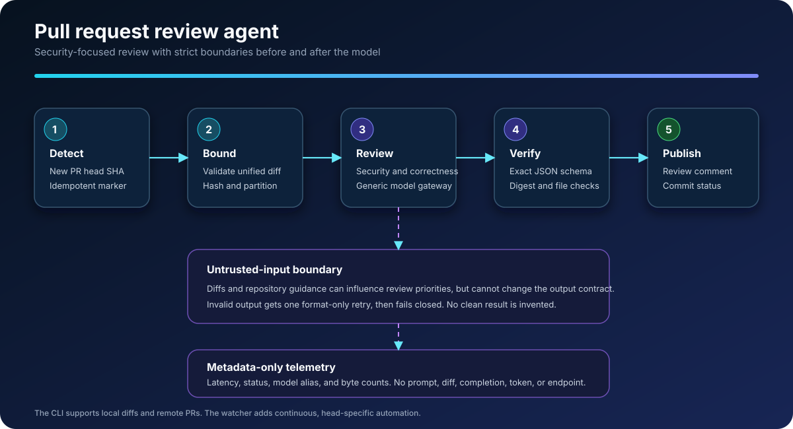

# PR Review Agent

A focused pull-request review agent. It reviews a raw unified diff for security
vulnerabilities and correctness defects, then emits one machine-readable JSON
verdict.



## Output contract

Successful runs write only this JSON shape to standard output:

```json
{
  "schema_version": "1.0",
  "input_sha256": "d68448f3c511ff0b58014574b183efef31c38752d2cb5bd5eed27a0ce1c5a60b",
  "risk": "high",
  "blocked": true,
  "findings": [
    {
      "severity": "blocker",
      "category": "security",
      "file": "src/database.ts",
      "line": 42,
      "detail": "User-controlled input is interpolated directly into a SQL query."
    }
  ],
  "rationale": "The change introduces a directly exploitable SQL injection vulnerability."
}
```

The agent fails closed:

- A `blocker` or `major` finding requires `blocked: true`.
- `blocked: true` requires at least one `blocker` or `major` finding.
- Risk is deterministic: any blocker is `high`; otherwise any major is `medium`; otherwise risk is `low` and the review is not blocked.
- Missing, malformed, or inconsistent model output exits nonzero.
- Invalid JSON formatting receives one bounded retry, then fails closed.
- `input_sha256` must match the SHA-256 of the exact raw diff bytes.
- There is no low-risk fallback.

## Requirements

- Node.js 22 or newer
- An OpenAI-compatible model gateway
- GitHub CLI, authenticated with `gh auth login`, for remote pull requests

Install dependencies and build:

```bash
npm ci
npm run build
```

Copy `.env.example` into your preferred local secret manager or shell configuration. The CLI reads environment variables directly and does not load `.env` files itself.

Required configuration:

```bash
export MODEL_GATEWAY_API_KEY="..."
export MODEL_GATEWAY_BASE_URL="https://gateway.example/v1"
export REVIEW_AGENT_MODEL="your-model-id"
```

## Usage

For the simplest workflow, install the local command once:

```bash
npm link
```

Then enter any Git repository and run:

```bash
pr-review
```

The command compares the current branch and working tree with `origin/main`,
automatically uses a root `AGENTS.md` when present, and prints the review. It
falls back to `main`, `origin/master`, or `master` when needed. Override the
base branch only when necessary:

```bash
pr-review --base develop
```

Review an existing GitHub pull request without switching branches or changing
the working tree:

```bash
pr-review-pr 42
```

The command uses the authenticated GitHub CLI to fetch the remote diff. It
prints the review locally and does not modify the pull request by default. To
also publish a non-blocking review comment on GitHub:

```bash
pr-review-pr 42 --publish
```

Publishing uses the identity currently authenticated by `gh`. It submits a
comment only. It never approves the pull request or requests changes. Run from
the target repository to load its root `AGENTS.md`. A repository can also be
selected explicitly without checking it out:

```bash
pr-review-pr 42 --repo owner/repository
```

When `--repo` targets a repository that is not checked out, no local
`AGENTS.md` is loaded.

### Continuous pull request reviews

`pr-review-watch` polls a comma-separated repository list and reviews each new
pull request head SHA once per review-policy version. It publishes a review
comment and commit status, then recognizes its versioned marker after restarts
so it does not duplicate the same review. Updating the policy version allows a
corrected policy to re-check an unchanged head.

```bash
export GITHUB_TOKEN="..."
export GITHUB_REPOSITORIES="owner/one,owner/two"
pr-review-watch
```

The companion evaluation repository includes a local k3s deployment that
builds this watcher, stores credentials in a Kubernetes Secret, and sends
metadata-only traces through an OpenTelemetry privacy filter.

The lower-level commands below remain available for automation and evaluation.

Pass a unified diff on standard input:

```bash
git diff origin/main...HEAD | npm run --silent review
```

Or read it from a file:

```bash
npm run --silent review -- --diff ./change.diff
```

Optionally supply repository-specific review guidance, such as an `AGENTS.md`
file. Guidance is treated as untrusted context and cannot change the output
contract or system rules:

```bash
git diff origin/main...HEAD | npm run --silent review -- \
  --instructions ./AGENTS.md
```

On success, standard output contains only the JSON verdict. Diagnostics go to standard error. An empty diff, a model failure, or invalid model output exits nonzero.

Input must be valid UTF-8 and is capped at 1 MiB. The SHA-256 is computed from the exact input bytes before decoding. Large multi-file diffs are divided at file boundaries into bounded model requests, then merged deterministically. A single file that cannot fit in one request fails closed. Repository guidance is capped at 16 KiB. Model output is capped at 1 MiB per request, and each request is capped at 120 seconds.

An evaluator may set `AGENT_EVAL_FEEDBACK` for a retry. Nonempty feedback is supplied to the model as additional review guidance without changing the diff or output schema. The CLI never prints feedback, case identifiers, expected findings, or scoring thresholds.

The model child receives only system essentials, the required gateway variables,
the model identifier, and an allowlist of non-secret OTel transport settings.
Exporter headers and resource attributes are excluded. Evaluator feedback is
embedded in the request and is not copied into the child environment.

## Optional OpenTelemetry

Tracing is enabled when either `OTEL_EXPORTER_OTLP_ENDPOINT` or `OTEL_EXPORTER_OTLP_TRACES_ENDPOINT` is set. Configuration uses standard OpenTelemetry environment variables:

```bash
export OTEL_SERVICE_NAME="pr-review-agent"
export OTEL_EXPORTER_OTLP_ENDPOINT="http://localhost:4318"
export OTEL_EXPORTER_OTLP_PROTOCOL="http/protobuf"
```

No telemetry backend is required for normal operation.

Telemetry is implemented with a manual metadata-only span, and OpenTelemetry
resource auto-detection is disabled. Traces contain request status, latency,
the public model alias, and the input byte count. Raw diffs, prompts, model
output, credentials, endpoints, process arguments, local paths, and usernames
are not exported. Review input is sent to the isolated model child over standard
input, so it is not exposed in the child process arguments.

## Design influences

This agent independently applies three proven ideas documented by
[PR-Agent](https://github.com/qodo-ai/pr-agent): bounded handling of large pull
requests, repository-specific context, and a self-check that removes unsupported
or duplicate findings. It keeps a smaller scope and its own strict JSON,
digest-binding, fail-closed, and telemetry privacy controls. No PR-Agent source
code is included.

## Development

```bash
npm run typecheck
npm test
npm run build
npm audit --audit-level=high
```

Unit tests use injected process results and never call a model or network service.

## Scope

This repository contains only the review agent. Evaluation datasets, judge models, score aggregation, and benchmark dashboards belong in a separate evaluation system.

## License

Apache-2.0. See [LICENSE](LICENSE).
